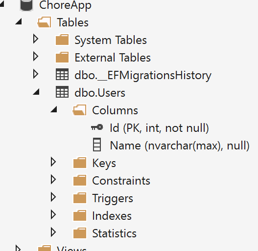
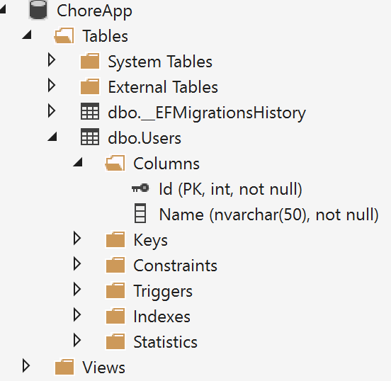

# EF Core
We are going to pick up from the last session and work with the ChoreRepository.cs file and add database support through EF Core.

The ChoreRepository did an excellent job of outlining the models and behavior needed for the ChoreApp, and now is the time to start moving the project to production.  One of the primary strength of MVC is how it lends itself to separating concerns. We could have one project and dump everything into it, but that's no fun. The Start folder contains a refactored version of the SimpleAspNetCore application to help get things started to work with EF Core. The primary changes other than moving the classes to individual files is the domain models are moved into its own project. Below is an outline of the changes that were made. 

1. Solution renamed to ChoreApp because it will be containing more than just the SimpleAspNetCore project.
2. A .NET Core Library project named "ChoreApp" was added. 
3. The models classes from the ChoreRepository file were moved to this project 
    and refactored to work with EF Core by adding parameter less contractors, 
    and changing private property setters to public.
4. The exception classes were also moved to this project.
5. An interface was extracted from the ChoreRepostory class and added to the Contracts folder.

The SimpleAspNetCore project have the following changes

1. Reference to ChoreApp library project was added.
2. ChoreRepository class was renamed to ChoreRepositoryStub and inherits from IChoreRepository.
3. Startup changes
   1. DI changed to use IChoreRepository
4. Controller changes
   1. Change ChoreRepository to use IChoreRepository


## Adding EF Core project
1. Add a new project by selecting File -> New -> Project
2. Select .NET Core on the left of the New Project dialog box
3. Select Console Application (.NET Core)
4. Name the project ChoreApp.DataStore

The reason we are using a Console Application rather than a Class Library project has to do with the tooling for Migrations. The .NET Core CLI must be able run a .NET Core app that targets a framework, and class Library projects are built without a framework. Therefore dotnet-ef cannot run against a library project. So as of now if you want to separate your EF Core code and use Data Migrations a console app is the only option.

To add EF Core open the project.json file and the following to "dependencies" 
```javascript
    "Microsoft.EntityFrameworkCore.SqlServer": "1.0.1",
    "Microsoft.EntityFrameworkCore.Tools": "1.0.0-preview2-final",
```
Add the following "tools" section after "dependencies"
```javascript
  "tools": {
    "Microsoft.EntityFrameworkCore.Tools": {
      "version": "1.0.0-preview2-final",
      "type": "build"
    } 
  },
```
By adding Microsoft.EntityFrameworkCore.SqlServer this will provide support for EF Core and SQL Server Data Provider.
If you wanted target a different provider list SQLite you would use "Microsoft.EntityFrameworkCore.SQLite". 
The other settings are strictly for tooling and how Migrations are executed.

Since we want our data access to participate with dependency injection we need to add the 
    following to dependences.
```javascript
    "Microsoft.Extensions.Configuration": "1.0.1",
    "Microsoft.Extensions.Configuration.Abstractions": "1.0.1",
    "Microsoft.Extensions.Configuration.FileExtensions": "1.0.1",
    "Microsoft.Extensions.Configuration.Json": "1.0.1"
```
Before we can build our data access code we need to add a reference to the ChoreApp library to dependencies.
```javascript
    "ChoreApp": { "target": "project" },
```
Add a new class to called "ChoreAppDbContext" and have it inherit from ChoreAppDbContext.

```c#
    public class ChoreAppDbContext : DbContext
    {
       
    }
```

Add the following for the constructor. This constructor will be used for Dependency Injection.
```c#
    private readonly IConfigurationRoot _configurationRoot;

    public ChoreAppDbContext(DbContextOptions<ChoreAppDbContext> options, IConfigurationRoot configurationRoot)
    {
        _configurationRoot = configurationRoot;
    }
```
Add the following code to override the OnConfiguring method.
```c#
    protected override void OnConfiguring(DbContextOptionsBuilder optionsBuilder)
    {
        base.OnConfiguring(optionsBuilder);
        optionsBuilder.UseSqlServer(_configurationRoot["Data:ConnectionString"]);
    }
```
Add a new JSON file named "appsettings.json" and add the following. Also add this to the appsettings.json file in the SimpleAspNetCore project.
```javascript
  "Data": {
    "ConnectionString": "Data Source=(localdb)\\MSSQLLocalDB;Initial Catalog=ChoreApp;Integrated Security=True;Connect Timeout=30;Encrypt=False;TrustServerCertificate=True;ApplicationIntent=ReadWrite;MultiSubnetFailover=False"
  }
```

Like the SimpleAspNetCore project our EF project will also need a Startup class. Add the class to the root of the project with the following code.
```c#
    public class Startup
    {
        private readonly IConfigurationRoot _configurationRoot;
        public Startup(IHostingEnvironment environment)
        {
            var builder = new ConfigurationBuilder()
                .SetBasePath(environment.ContentRootPath)
                .AddJsonFile("appsettings.json");

            _configurationRoot = builder.Build();
        }

        public void ConfigureServices(IServiceCollection services)
        {
            services.AddSingleton(_configurationRoot);
            services.AddDbContext<ChoreAppDbContext>(ServiceLifetime.Scoped);
        }
    }
```
The only major difference in this start up class is the AddDbContext method in the ConfigureServices. This is adding our DbContext type to the service container. The ServiceLifetime.Scoped means the ChoreAppDbContext will be created for each service request. This generally the preferred setting for web applications.

This takes care of the basic plumbing required to EF support into a project. The real fun begins with building the data model. 

## Building the Data Model &amp; Database

Entity Framework can take your POCO classes and convert them into a relational database. It does this by making heavy use of conventions, but also uses a Fluent API and Data Annotations to augment and fine tune configuration. 

You can make use of all three methods and generally my preferred approach. As a side note my general rule is when the configuration has to do with the database I use the Fluent API, and when it has to do with the model especially when it comes to validation I use Data Annotations. 

Lets add our first entity model to the database. Open the ChoreAppDbContext class and add the following after the constructor.
```c#
    public DbSet<User> Users { get; set; }
```
By adding this property EF now has enough information to add and maintain a table in your target database. It also means you can use LINQ to build query the database and your data context to do CRUD operations on this table. 

Open the User class in the ChoreApp.DataStore project.
```c#
    public class User
    {
        public User() { }
        
        public User(int id, string name):this()
        {
            Id = id;
            Name = name;
        }
        
        public int Id { get; set; }
        public string Name { get; set; }
    }
```
By convention EF will create a table called Users and it will contain to columns for the Id and Name properties. 

It will make Id the primary key because it is named Id, but would also accept UserId for the primary key. If an entity class had an atypical primary key property you can use either the Fluent API or Data Annotations to define your primary key.

For Data Annotations add the Key attribute to the property you want to use for the primary key.
```c#
    public class User
    {   
        [Key]
        public int StrangePrimaryKey { get; set; }
        public string Name { get; set; }
    }
```

To setup Fluent API for your models you must override OnModelCreating method in your DbContext class. So for the above example you would add the following to the ChoreAppDbContext class.
```c#
    protected override void OnModelCreating(ModelBuilder modelBuilder)
    {
        modelBuilder.Entity<User>()
            .HasKey(c => c.StrangePrimaryKey);
    }
```
The Name property as it is currently defined would be added to the Users table as an optional nvarchar(max) column.  



If your primary goal is to give your DBA holy hell then don't change this. However if you listen to your mother and pre-school teachers and want to play nice with others modified this property to have a fix length. Also given the nature of this property it should also be required.

Data Annotations method
```c#
    public class User
    {
        public User() { }
        
        public int Id { get; set; }

        [Required]
        [MaxLength(50)]
        public string Name { get; set; }
    }
```
Fluent API method
```c#
    protected override void OnModelCreating(ModelBuilder modelBuilder)
    {
        modelBuilder.Entity<User>()
            .Property(p => p.Name)
            .IsRequired()
            .HasMaxLength(50);
    }
```    

To sum up. If a property can be null it is optional otherwise it will be required. For value properties like int if you want to make them optional the property must be made nullable.

```c#
    public int? MyNullableInt { get; set; }
    // or
    public Nullable<int> MyOtherNullableInt { get; set; }
```

### Data Migrations
We now have enough to build the database using Migrations. Open a command window to the project's directory. The easiest way to do this is to:
  1. In Visual Studio right-click the project in Solution Explorer and select "Open Folder in File Explorer".
  2. From File Explorer hold down the Shift key and right-click the project folder and select "Open command window here"

Once you have the command window open type the following command to create your first migration.
```
    dotnet ef migrations add InitialCreate
```
If there are no issues you should see message:
```
Done.

To undo this action, use 'dotnet ef migrations remove'
```
If there are no build issues and see a message similar to:
```
No executable found matching command "dotnet-ef"
```
or
```
No parameterless constructor was found on 'ChoreAppDbContext'. Either add a parameterless constructor to 'ChoreAppDbContext' or add an implementation of 'IDbContextFactory<ChoreAppDbContext>' in the same assembly as 'ChoreAppDbContext'.
```
This usually means the tooling is not configured properly most likely due to a typo in project.json or the version of the tooling does not work with the version of EF Core you are targeting. The second error can also be due the DbContext not being added to the service container in StartUp.cs.

Once you have a successful execution a new Migrations folder is added to the project. Each time you use the `migrations add` command new code is generated that instructions EF on how to apply the changes to your target database and also how to remove the changes should you want to rollback the change. In addition to migration code a snap-shot of the current database schema is generated.

To apply the migration to the database use the following:
```
dotnet ef database update
```
You can now open the SQL Server Object Explorer to see the new database.
### Back to the Data Model
With our database created you should have schema like.



Lets add the next entity model `Chore` to our database. We have a couple of options. We could add another `DbSet<Chore>` property to the `ChoreAppDbContext`, but lets take a different approach by modifying both the `User` and `Chore` class.

Change the `User` class by adding the following property.
```c#
public IList<Chore> Chores { get; set; }
```

Then modify the constructors to make sure the list of chores properly initialized.
```c#
    public User()
    {
        Chores = new List<Chore>();
    }
    public User(int id, string name):this()
    {
        Id = id;
        Name = name;
    }
```

In the Chore class comment out all references to the ChildId  property. Then from the command window add another migration and update the database.
```
dotnet ef migrations add AddChores
```
```
dotnet ef database update
```